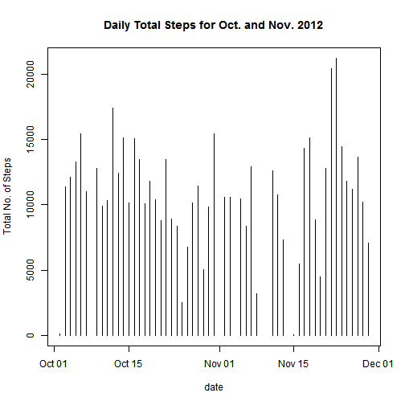
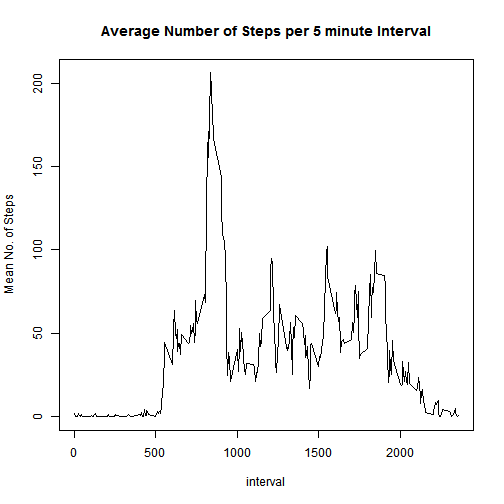
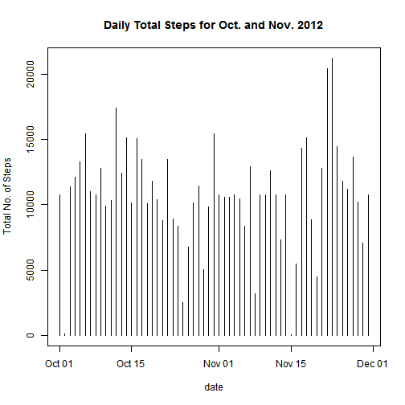
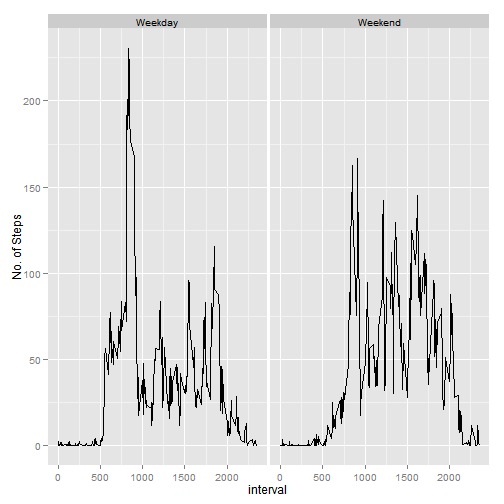

Reproducible Research: Assignment 1
-----------------------------------


Step 1: Load the data


```r
setwd("C:\\Users\\vuser\\Desktop\\Coursera\\Reproducible Research\\Assignment 1")
activity <- read.csv("./activity.csv", stringsAsFactors=F)
```

Step 2: Process/transform data into a format suitable for your analysis

```r
activity$date <- as.Date(activity$date, format="%Y-%m-%d")
```

Q1: What is the total number of steps taken per day (ignore missing values)?
Make a histogram and calculate the mean and median total number of steps taken per day.

```r
activity_short <- activity[which(activity$steps>=0),]
steps_total <- aggregate(steps~date, data=activity_short, FUN=sum)
with(steps_total, plot(date, steps, main="Daily Total Steps for Oct. and Nov. 2012", ylab="Total No. of Steps", type="h"))
```

 

```r
steps_mean <- round(mean(steps_total$steps),0)
steps_median <- median(steps_total$steps)
```

**The mean  number of steps taken per day is 1.0766 &times; 10<sup>4</sup> and the median number of steps taken per day is 10765.**

Q2: What is the average daily activity pattern? Make a time series plot of the 5 minute inteval and the average number
of steps taken. Which 5 minute interval, on average across all days, contains the max. number of steps?


```r
interval_mean <- aggregate(steps~interval, data=activity_short, FUN=mean)
with(interval_mean, plot(interval, steps,type="l", main="Average Number of Steps per 5 minute Interval", ylab="Mean No. of Steps"))
```

 

```r
max_steps<- max(interval_mean$steps)
interval_max <-interval_mean[which(interval_mean$steps==max_steps),1]
```

**The 835th interval , on average across all days, contains the maximum number of steps.**

Q3: Input Missing Data.
    1. Calculate and report total number of missing values in the dataset.
    2. Devise a stategy for filling in all the missing data.
    3. Create a new dataset with the missing values filled in.
    4. repeat Q1 using the new dataset (see step 3). Do these values differ from the orginial dataset? What is the impact of imputting missing data?
    

```r
total_missing <-  nrow(activity[which(is.na(activity$steps)),])
```

**There are 2304 missing rows in the activity dataset.**

All data that is labeled as "NA" will be filled in with the mean number of steps for that interval.


```r
activity_new <- activity
interval_flag <- 0
for(i in 1:nrow(activity)){
  if(is.na(activity[i,1]==TRUE)){
    interval_flag <- activity[i,3] 
    activity_new[i,1]<-interval_mean[which(interval_mean$interval==interval_flag),2]
    i=i+1
  }
  else{
    i=i+1 
  }
}

steps_total_new <- aggregate(steps~date, data=activity_new, FUN=sum)
with(steps_total_new, plot(date, steps, main="Daily Total Steps for Oct. and Nov. 2012", ylab="Total No. of Steps", type="h"))
```

 

```r
steps_mean_new <- mean(steps_total_new$steps)
steps_median_new <- median(steps_total_new$steps)
```

**The mean  number of steps taken per day is 1.0766 &times; 10<sup>4</sup> and the mean number of steps taken per day with filled in data is 1.0766 &times; 10<sup>4</sup>. The median number of steps taken per day is 10765 and the median number of steps taken per day with filled in data is 1.0766 &times; 10<sup>4</sup>. The values only differ slightly for the median. Using the mean value for the specified interval that is missing does not seem to change the overall results for mean number and median number of steps taken per day.**

Q4: Are there differences in activiy patterns between the weekdays and the weekend?
  1. Create a new factor variable in the dataset with two levels - "weekday" and "weekend" indicating whether a given date is a weekday or weekend day.
  2. Make a panel plot containing a time series plot (i.e. type = "l") of the 5-minute interval (x-axis) and the average number of steps taken, averaged across all weekday days or weekend days (y-axis). 

```r
activity_new$weekday <- weekdays(activity_new$date)
activity_new$weekday_flag <- 0
for(i in 1:nrow(activity_new)){
  if(activity_new[i,4]=="Saturday" | activity_new[i,4]=="Sunday"){
    activity_new[i,5] <- "Weekend"
    i=i+1
  }
  else{
    activity_new[i,5] <- "Weekday"
    i=i+1
  }
}

interval_mean_new <- aggregate(steps~interval+weekday_flag, data=activity_new, FUN=mean)
library(ggplot2)
qplot(interval, steps, data=interval_mean_new, facets=.~weekday_flag, ylab="No. of Steps", geom="line")
```

 
